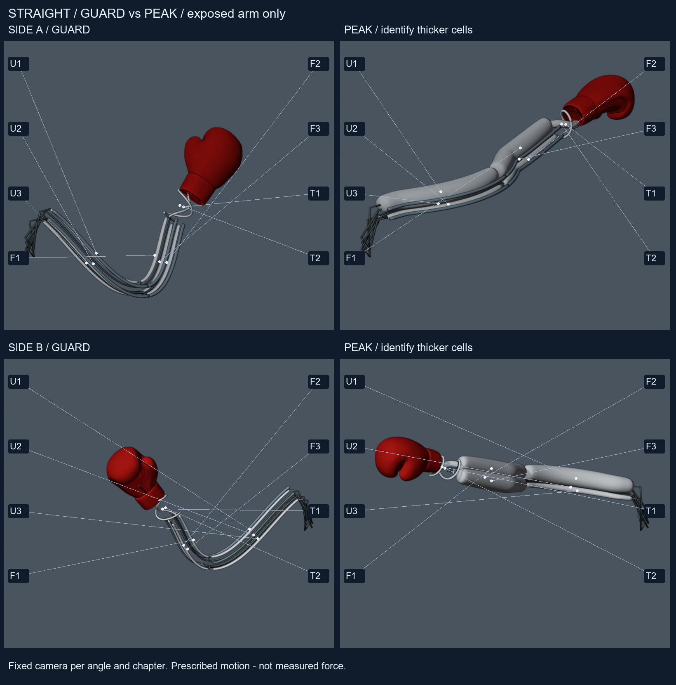
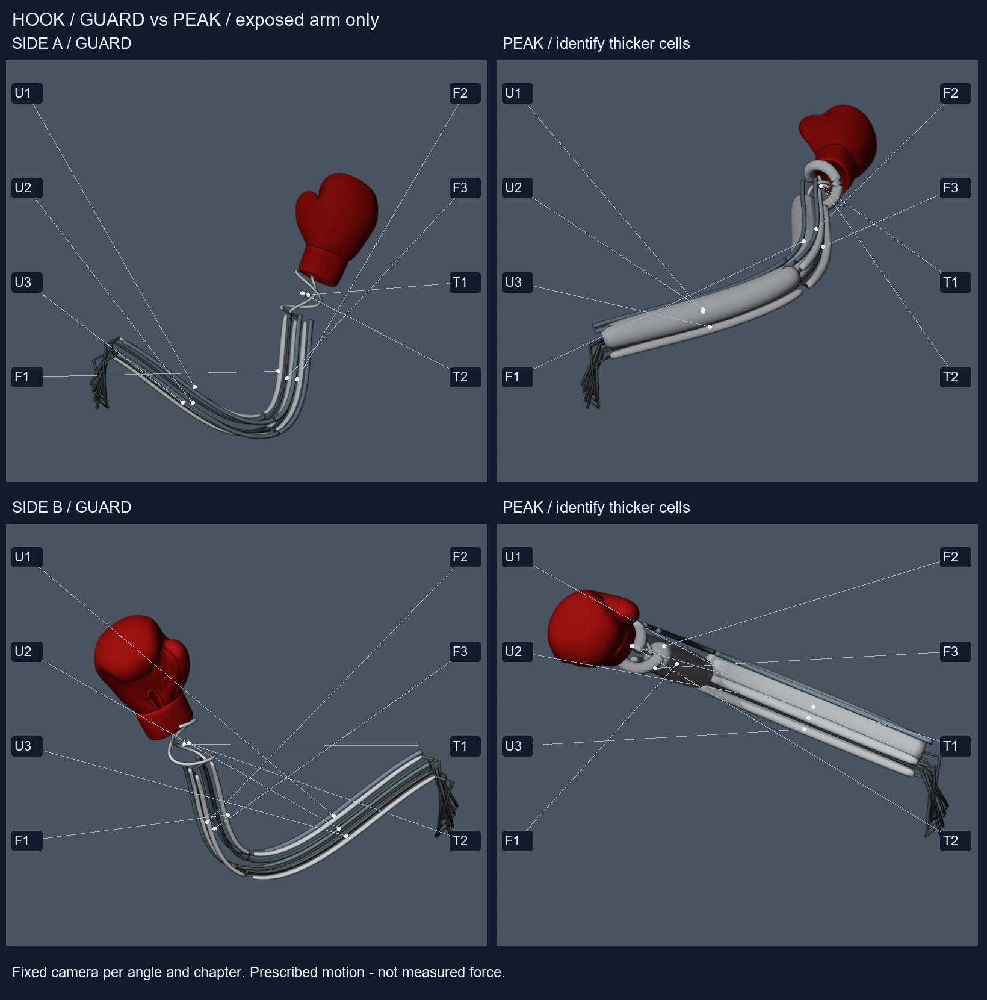
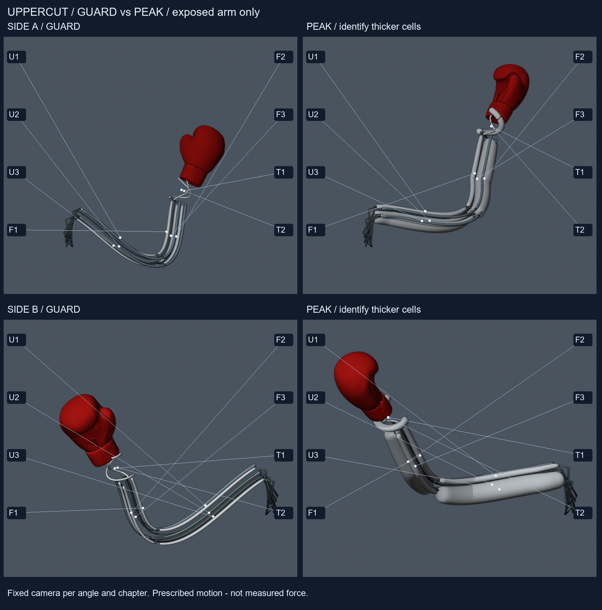
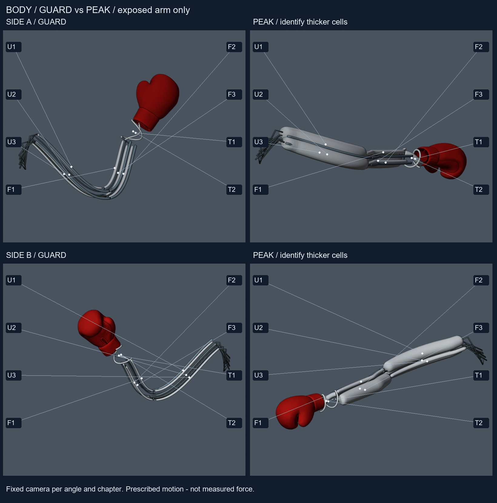

# C. Exposed-arm pose atlas

Review these without the answer key. Top row: side A guard/peak. Bottom row: opposite side B guard/peak. Same assembled cells and fixed camera within each angle/chapter.

## Straight

[Decoded phase sheet](media/qa_straight.png).

## Hook

[Decoded phase sheet](media/qa_hook.png).

## Uppercut

[Decoded phase sheet](media/qa_uppercut.png).

## Body

[Decoded phase sheet](media/qa_body.png).

**Track A does not prove strike impulse.** Swelling, bend and timing are prescribed illustrations, not a pneumatic solution or measured pressure, flow, strain, propulsion, contact force, durability or real CV.