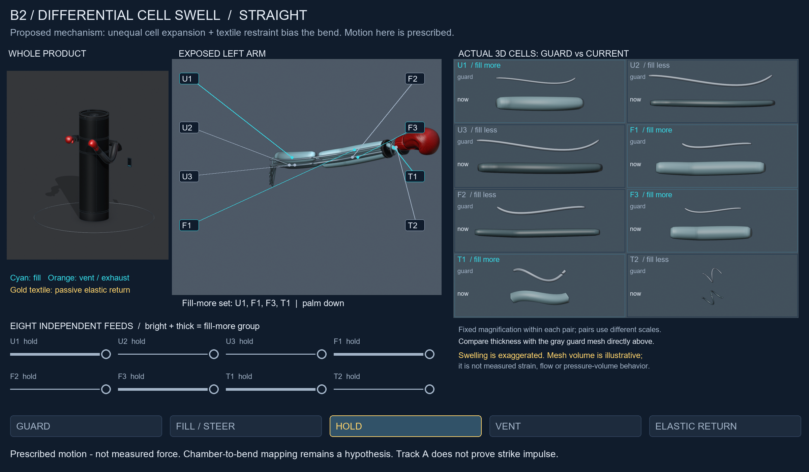
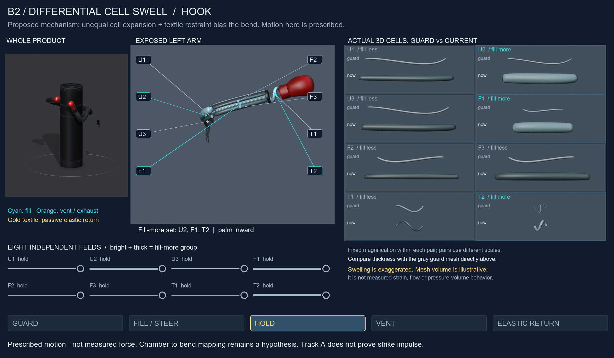
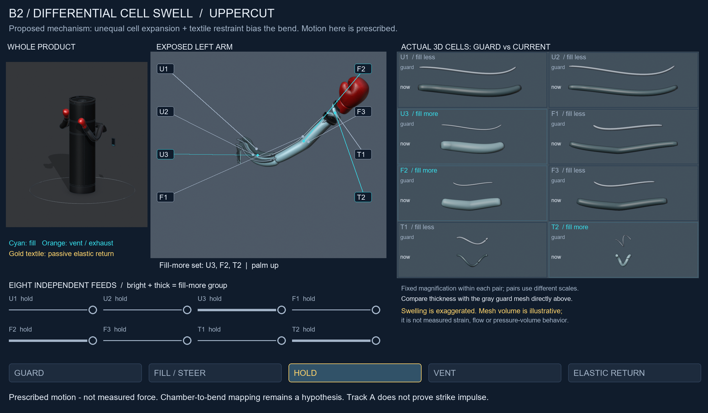
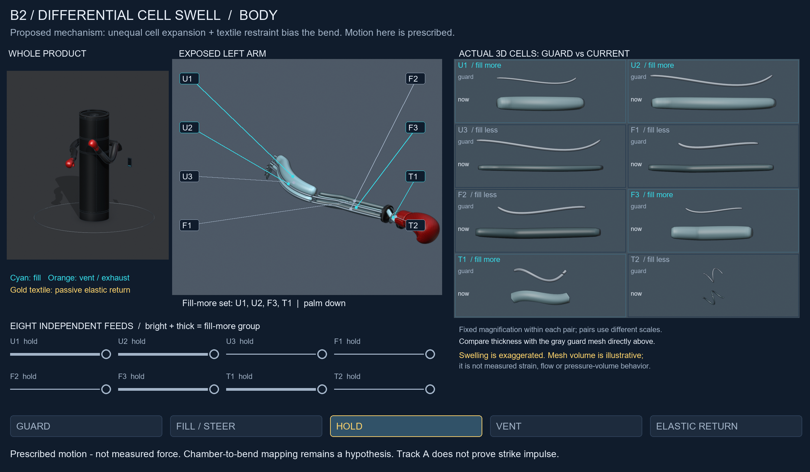

# C. Swell peaks and phase comparisons

Prescribed motion — not measured force. Educational cell widths are exaggerated.

## Straight

[Guard/peak 3D comparison with saved-mesh volume callouts](media/guard_peak_straight.png) ? [Guard](media/airflow_straight_00.png) · [Filling](media/airflow_straight_12.png) · [Venting](media/airflow_straight_23.png) · [Elastic return](media/airflow_straight_28.png) · [Returned guard](media/airflow_straight_31.png) · [Decoded phase sheet](media/qa_straight.png)

## Hook

[Guard/peak 3D comparison with saved-mesh volume callouts](media/guard_peak_hook.png) ? [Guard](media/airflow_hook_00.png) · [Filling](media/airflow_hook_12.png) · [Venting](media/airflow_hook_23.png) · [Elastic return](media/airflow_hook_28.png) · [Returned guard](media/airflow_hook_31.png) · [Decoded phase sheet](media/qa_hook.png)

## Uppercut

[Guard/peak 3D comparison with saved-mesh volume callouts](media/guard_peak_uppercut.png) ? [Guard](media/airflow_uppercut_00.png) · [Filling](media/airflow_uppercut_12.png) · [Venting](media/airflow_uppercut_23.png) · [Elastic return](media/airflow_uppercut_28.png) · [Returned guard](media/airflow_uppercut_31.png) · [Decoded phase sheet](media/qa_uppercut.png)

## Body

[Guard/peak 3D comparison with saved-mesh volume callouts](media/guard_peak_body.png) ? [Guard](media/airflow_body_00.png) · [Filling](media/airflow_body_12.png) · [Venting](media/airflow_body_23.png) · [Elastic return](media/airflow_body_28.png) · [Returned guard](media/airflow_body_31.png) · [Decoded phase sheet](media/qa_body.png)

The full 38-case geometry atlas is retained in the successor Blender file and remains available in the [parent packet](../n3-standoff-pitch-policy/POSE_ATLAS.html).

**Track A does not prove strike impulse.** These are prescribed geometry and illustrative pneumatic cues. Measured propulsion, contact force, durability and real CV remain unverified.