# Airflow film review guide

Watch cyan fill and orange vent change with the phase strip, then gold textile recoil during vent/return. The eight numbered labels identify the actual cells, while the adjacent diagram separates the manifold ports. Cell-to-direction assignments are uncalibrated hypotheses, not an identified plant model.

## Straight — differential fill/steer

Prescribed qualitative cues — not measured flow or force.

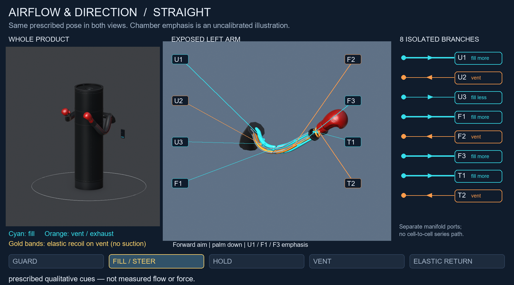

## Straight — vent with elastic recoil

Prescribed qualitative cues — not measured flow or force.

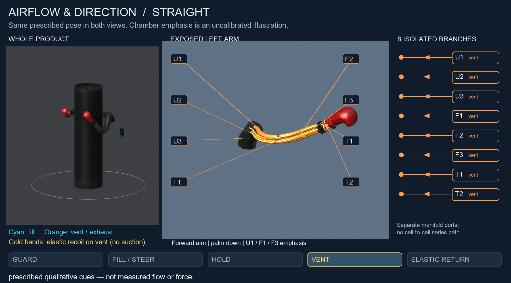

## Straight — elastic return

Prescribed qualitative cues — not measured flow or force.

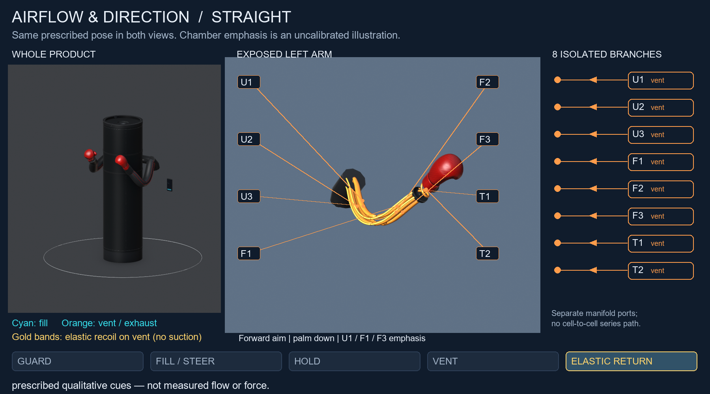

## Hook — differential fill/steer

Prescribed qualitative cues — not measured flow or force.

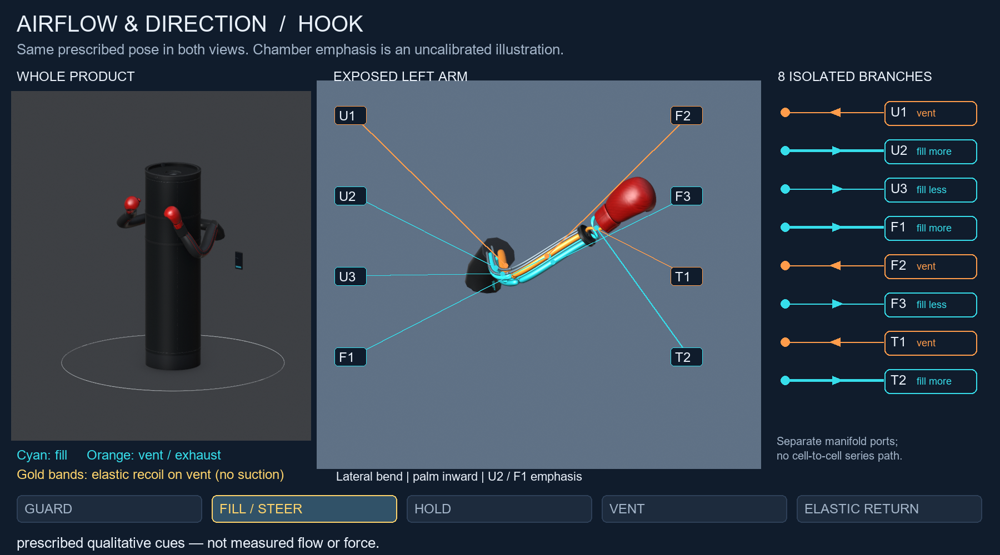

## Hook — vent with elastic recoil

Prescribed qualitative cues — not measured flow or force.

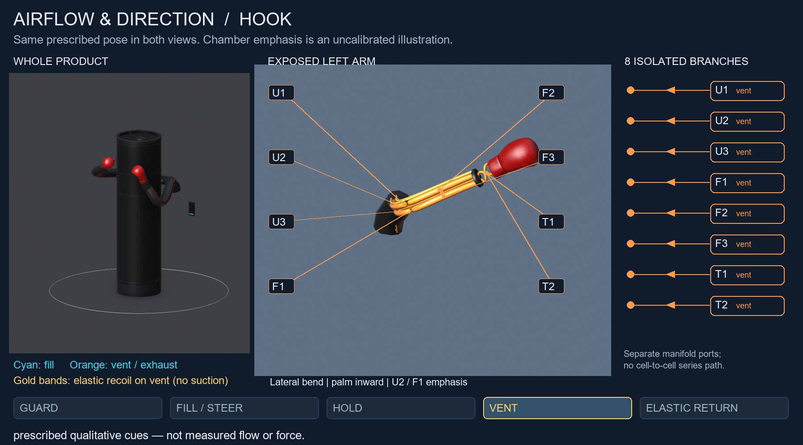

## Hook — elastic return

Prescribed qualitative cues — not measured flow or force.

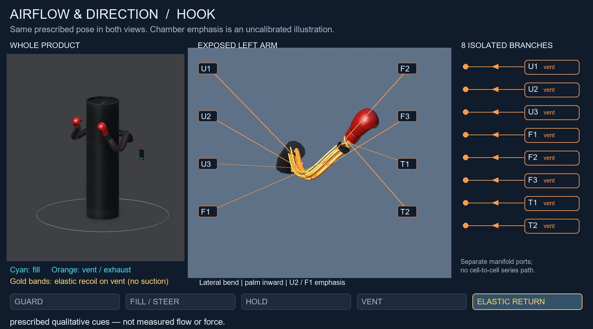

## Uppercut — differential fill/steer

Prescribed qualitative cues — not measured flow or force.

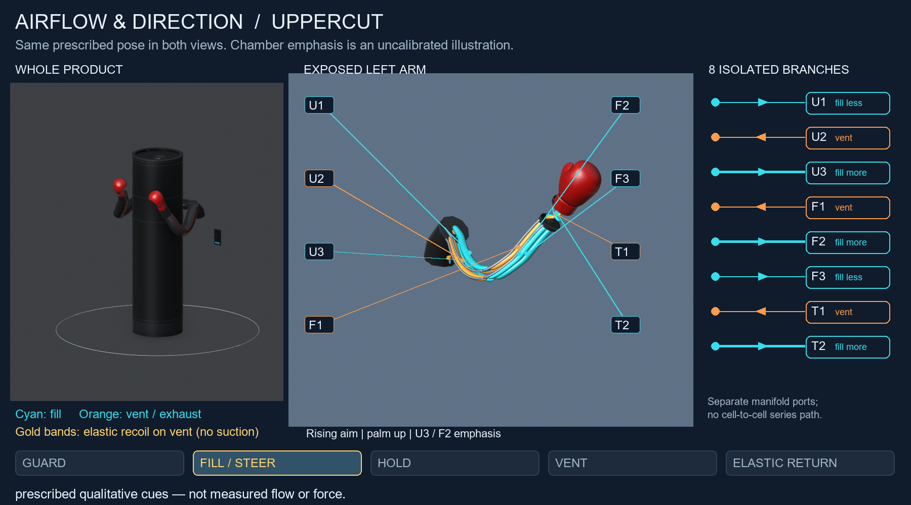

## Uppercut — vent with elastic recoil

Prescribed qualitative cues — not measured flow or force.

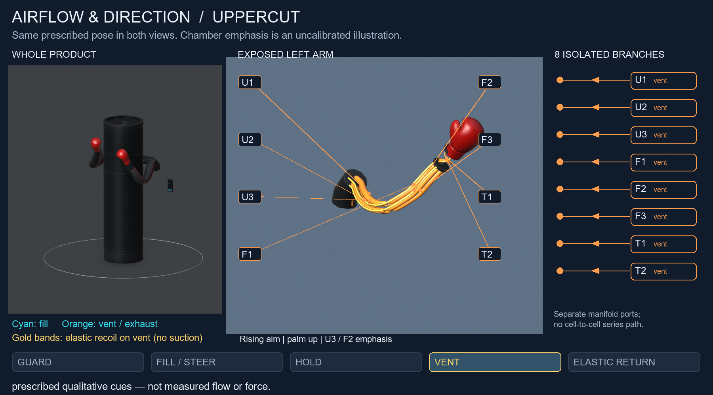

## Uppercut — elastic return

Prescribed qualitative cues — not measured flow or force.

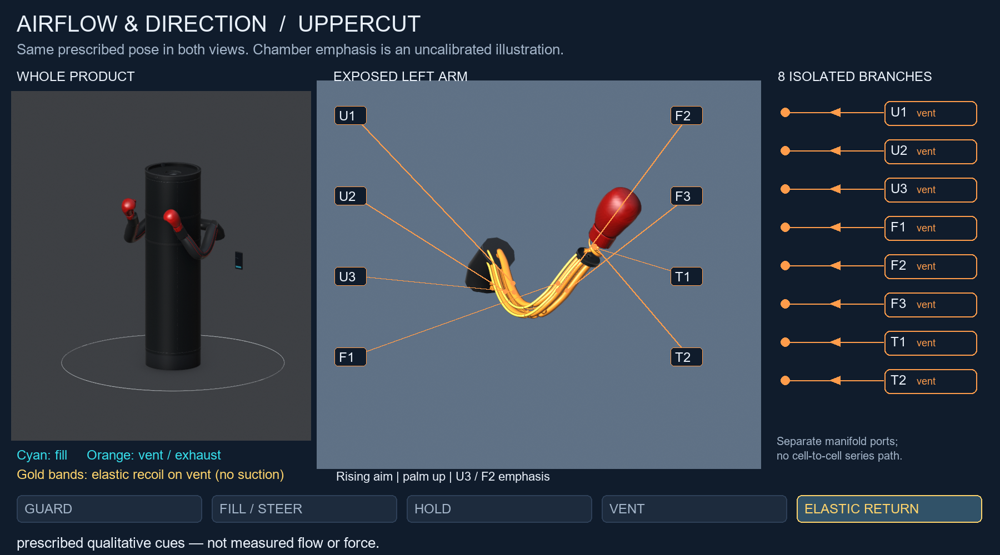

## Body — differential fill/steer

Prescribed qualitative cues — not measured flow or force.

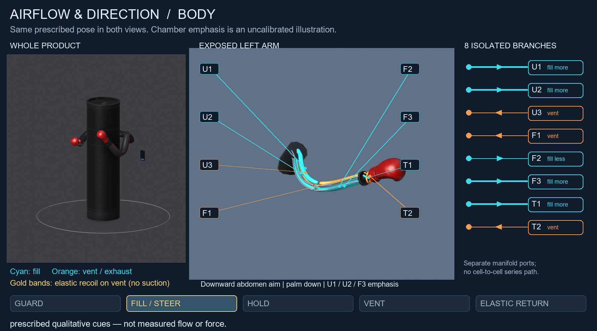

## Body — vent with elastic recoil

Prescribed qualitative cues — not measured flow or force.

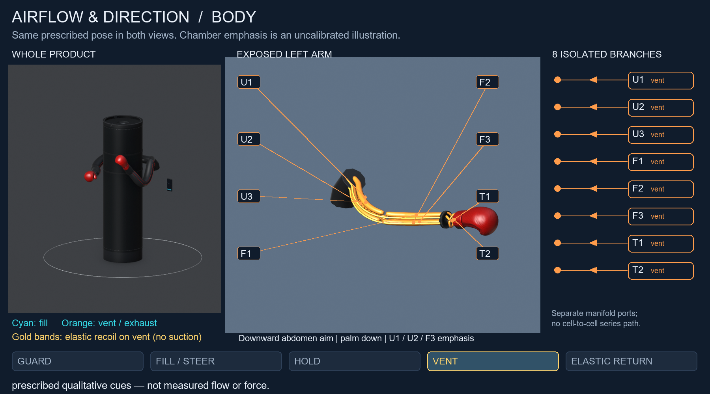

## Body — elastic return

Prescribed qualitative cues — not measured flow or force.

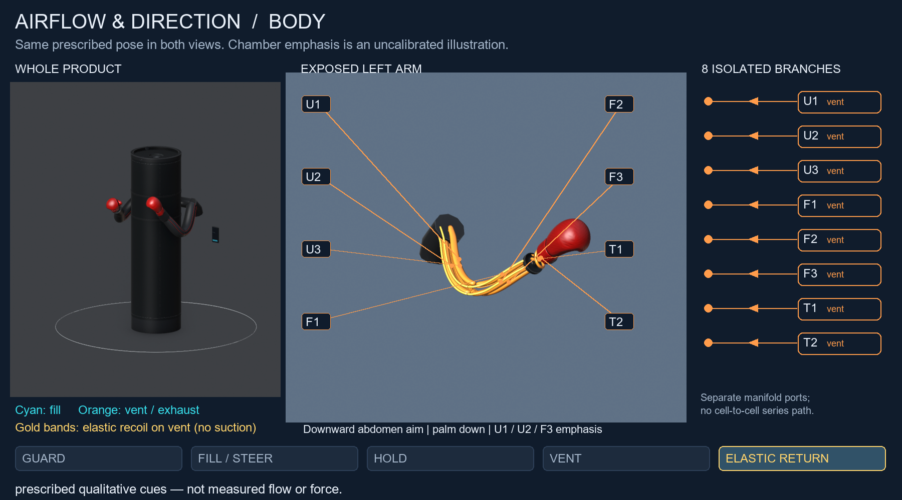

## Plain-language glossary

| Term | Everyday meaning | Why it matters in this pass |
|---|---|---|
| Yaw | Turning the shoulder carrier left/right around the mast. | Held at zero here to isolate height and reach; bag stays stationary. |
| Pitch | Tipping the arm's outbound aim up/down at its root. | A real model-parent rotation, not a camera move; hardware still open. |
| Height preset | Saved root angle for a short, mid or tall target. | Base pitch is 8, 16 or 24 degrees; some punch types add a stated trim. |
| R_max | The longest useful reach in the design case. | Tall means a chosen guard box for the 6-foot-3 to 6-foot-5 case, not proof of coverage for every person. |
| Chord / partial extension | Straight-line shoulder-to-wrist distance / using less of it. | The straight family measures about 429, 601 and 859 mm; these are prescribed geometry. |
| Body punch | A punch aimed at the abdomen. | Both arms use a lowered root aim and a full-length, downward path. |
| Fill / vent | Air entering a cell / air leaving through exhaust. | Cyan and orange distinguish the illustrative direction cues. |
| Isolated branch | One cell's own hose and valve route. | Eight separate paths; air is not shown passing through one cell to the next. |
| Elastic return | Stretched textile springing back as air is released. | Gold return bands explain retraction; no suction is claimed. |
| G-03 / G-05 | Arm-to-bag proxy / gaps above and below the rotating cover. | Sampled digital gaps pass; seams, padding and loaded collision are not checked. |
| A-05 / A-03 | Wrist-glove registration / chamber-cue clarity. | Registration passes and the film identifies cells and phases; this is not calibrated control. |
| CLOSED-A | Closed for a stated digital-model check only. | Does not mean safe, manufacturable or impact qualified. |
| B-03 / B-06 | Textile interface retention / root and structural load path. | Routing and pitch changes need engineering detail and physical verification. |
| C-01 | Missing measured propulsion-to-contact evidence. | Remains Critical / OPEN; films cannot close it. |
| RH-01 / RH-02 / RH-03 | Tall reach policy / partial aim / changed routing envelope. | Geometry exposes these review decisions; none is a physical performance result. |
| Track A | Digital model, audits and review films. | Makes assumptions visible; does not prove force. |

What changed / what is still not proven: we added height, reach, body-shot and air-path explanations with checked digital geometry; real punch power, loaded reach, retention and root hardware remain unproven.
