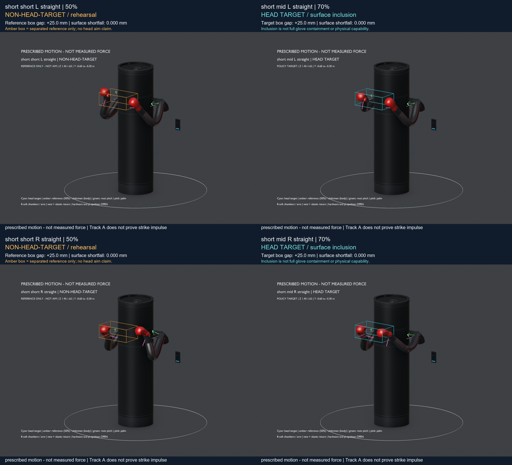
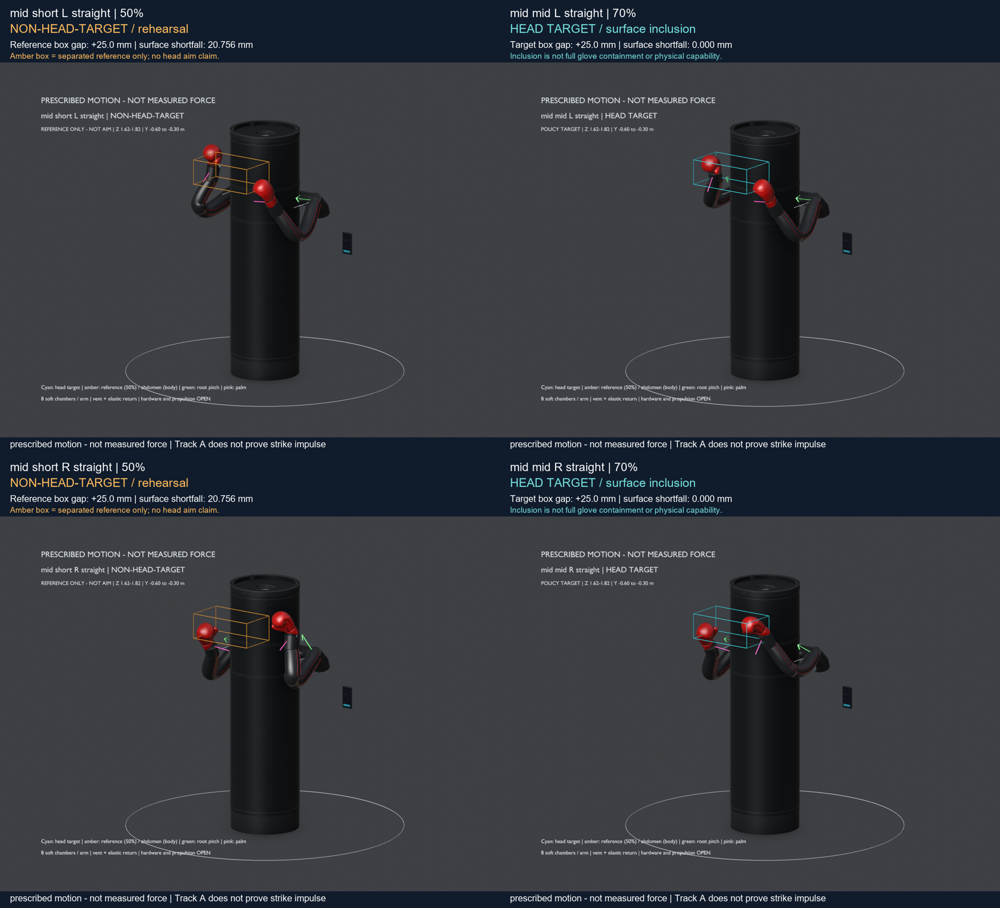
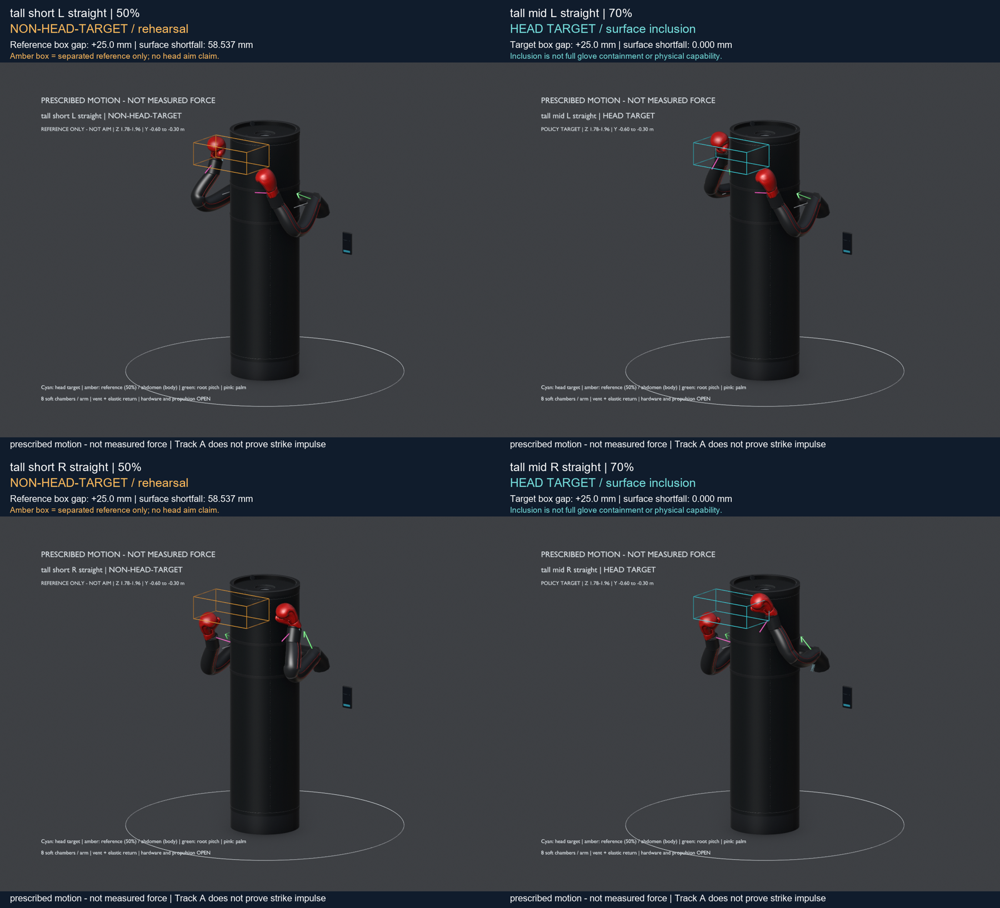

# C. Partial-extension comparison atlas

Amber references in 50% cases are not aim targets. Cyan targets in 70% retain the original surface-entry criterion. All images: **prescribed motion — not measured force**. Side labels L/R and preset names identify every chapter.

## Short partials

## Mid partials

## Tall partials

## All 38 saved peak poses

- [short_max_L_straight — head_target](media/stills/short_max_L_straight.png)
- [short_max_R_straight — head_target](media/stills/short_max_R_straight.png)
- [short_max_L_hook — head_target](media/stills/short_max_L_hook.png)
- [short_max_R_hook — head_target](media/stills/short_max_R_hook.png)
- [short_max_L_uppercut — head_target](media/stills/short_max_L_uppercut.png)
- [short_max_R_uppercut — head_target](media/stills/short_max_R_uppercut.png)
- [short_max_L_diagonal — head_target](media/stills/short_max_L_diagonal.png)
- [short_max_R_diagonal — head_target](media/stills/short_max_R_diagonal.png)
- [short_short_L_straight — NON-HEAD-TARGET reference](media/stills/short_short_L_straight.png)
- [short_mid_L_straight — head_target](media/stills/short_mid_L_straight.png)
- [short_short_R_straight — NON-HEAD-TARGET reference](media/stills/short_short_R_straight.png)
- [short_mid_R_straight — head_target](media/stills/short_mid_R_straight.png)
- [mid_max_L_straight — head_target](media/stills/mid_max_L_straight.png)
- [mid_max_R_straight — head_target](media/stills/mid_max_R_straight.png)
- [mid_max_L_hook — head_target](media/stills/mid_max_L_hook.png)
- [mid_max_R_hook — head_target](media/stills/mid_max_R_hook.png)
- [mid_max_L_uppercut — head_target](media/stills/mid_max_L_uppercut.png)
- [mid_max_R_uppercut — head_target](media/stills/mid_max_R_uppercut.png)
- [mid_max_L_diagonal — head_target](media/stills/mid_max_L_diagonal.png)
- [mid_max_R_diagonal — head_target](media/stills/mid_max_R_diagonal.png)
- [mid_short_L_straight — NON-HEAD-TARGET reference](media/stills/mid_short_L_straight.png)
- [mid_mid_L_straight — head_target](media/stills/mid_mid_L_straight.png)
- [mid_short_R_straight — NON-HEAD-TARGET reference](media/stills/mid_short_R_straight.png)
- [mid_mid_R_straight — head_target](media/stills/mid_mid_R_straight.png)
- [tall_max_L_straight — head_target](media/stills/tall_max_L_straight.png)
- [tall_max_R_straight — head_target](media/stills/tall_max_R_straight.png)
- [tall_max_L_hook — head_target](media/stills/tall_max_L_hook.png)
- [tall_max_R_hook — head_target](media/stills/tall_max_R_hook.png)
- [tall_max_L_uppercut — head_target](media/stills/tall_max_L_uppercut.png)
- [tall_max_R_uppercut — head_target](media/stills/tall_max_R_uppercut.png)
- [tall_max_L_diagonal — head_target](media/stills/tall_max_L_diagonal.png)
- [tall_max_R_diagonal — head_target](media/stills/tall_max_R_diagonal.png)
- [tall_short_L_straight — NON-HEAD-TARGET reference](media/stills/tall_short_L_straight.png)
- [tall_mid_L_straight — head_target](media/stills/tall_mid_L_straight.png)
- [tall_short_R_straight — NON-HEAD-TARGET reference](media/stills/tall_short_R_straight.png)
- [tall_mid_R_straight — head_target](media/stills/tall_mid_R_straight.png)
- [body_L — abdomen_target](media/stills/body_L.png)
- [body_R — abdomen_target](media/stills/body_R.png)
