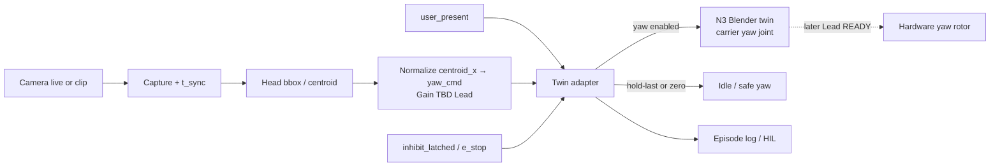

> **Ola integrate 2026-09-21: ACCEPTED-A.** Head-track → carrier yaw path approved for twin implementation. Assumptions table is the standing pattern. Queuing Codex NEXT_PROMPT for Blender UDP/JSON→bpy yaw bridge (no invented gains — use Lead TBD placeholders / tunable).

# Elias — Head track → carrier yaw (Blender / digital twin path)

| Field | Value |
|---|---|
| **Title** | Head tracking → rotate the carrier (yaw) — live camera + Blender/CAD twin path |
| **Rev** | DRAFT 2026-09-21 |
| **Author desk** | Elias (Controls & Perception under Ola) |
| **Disposition** | Ola (Lead Robotics) integrate |
| **Authority** | Michael correction / execute — **PAPER ONLY**; **NO POs**; **NO NEXT_PROMPT** (do not write ready_for_astra) |
| **Status** | DRAFT — MVP corrected: head track aims **carrier yaw**; common model; **not** a research pose / full athletic CV stack |
| **Product** | AI-Powered Boxing Training System |

**Normative sources (read order):**
- `LIVE_CAMERA_VIRTUAL_TWIN_ICD.md` (Ola start-here engineering) — MVP sensing, twin adapter, S0–S3
- `docs/engineering/CONTROLS_INHIBIT_ESTOP_LIMP_ICD.md` — session_enable; presence forever; inhibit / E-stop
- `docs/engineering/ELIAS_TWIN_ADAPTER_SIGNAL_TABLE.md` — signal names / fail-safes
- `docs/engineering/ELIAS_DIGITAL_HIL_SESSION_ENABLE_STUB.md` — digital enable + yaw_cmd truth cases
- `docs/engineering/ELIAS_CV_SYNTHETIC_DATASET_PLAN.md` — clip / episode schemas for replay V&V
- `sor_sync/B06_ROOT_PITCH_HARDWARE_SKETCH.md` — yaw rotor / encoder **F-05** context (strike path later)

**ACCEPTED-A safety (still holds — not re-asked):**
```
session_enable = user_present ∧ head_hypothesis_valid ∧ ¬ inhibit_latched
```
- Presence forever hard-interlocks **physical motion / pressurized strike**.
- S0/S1 head validity = **qualitative** spot-check only.
- Pitch lock (**F-01**) + encoder validity (**F-05**) required for **pressurized strike (S3) only**.
- **Yaw pedagogy / digital twin** may move under presence + session rules **without** requiring F-01 for digital twin yaw.

**No invented numbers** in this paper (no FPS, accuracy %, IoU, latency, gain values). Mapping gain, angle limits, and any numeric bars = **TBD — Lead**.

Identical mirrors: `docs/engineering/` and `sor_sync/`.

---

## Assumptions (Michael standing rule)

**Highlight assumptions wherever needed.** Label as **ASSUMPTION** (working prior until Lead freezes) or **TBD — Lead** (must not invent a number / bar). No quiet accuracy, FPS, IoU, latency, or gain claims.

| Item | Label | Statement |
|---|---|---|
| Camera / detector prior | **ASSUMPTION** | Default detect class = **MediaPipe-class** face/head; fallback = **OpenCV Haar or OpenCV DNN face**. Class only — **not** a pinned version or accuracy claim. |
| Camera optics / FOV | **TBD — Lead** | Mount height, FOV, distortion, and ROI crop **not** frozen; do not invent FOV degrees or pixel bars. |
| Presence thresholds | **TBD — Lead** | ToF/PIR/mat trip distances, debounce, and walk-in/out latency remain Lead TBD (ACCEPTED-A / Twin ICD). Fail-safe absent is normative; numeric thresholds are not. |
| Yaw gain / mapping | **TBD — Lead** | `yaw_cmd = map(head_centroid_x)` gain, clamps, units, and sign convention are Lead-owned — **no invented gain**. |
| `head_centroid_x` normalize | **ASSUMPTION** / **TBD — Lead** | Working prior: horizontal centroid normalized in frame (left…right). Exact convention (signed vs [0,1]) = **TBD — Lead**. |
| Confidence / validity cutoffs | **TBD — Lead** | S0/S1 `head_hypothesis_valid` = **qualitative** spot-check only (ACCEPTED-A (8)). No invented confidence floor, IoU, or accuracy %. |
| Sync tolerances | **TBD — Lead** | `t_sync` stale/unknown quality flag behavior is normative intent; declared sync tolerance for fusion = Lead TBD — do not invent ms bars. |
| Idle policy (hold-last vs zero) | **ASSUMPTION** / **TBD — Lead** | Working prior: prefer **zero / home-idle** on absent or E-stop; hold-last optional only for brief head-invalid while present. **Normative freeze = Lead**. |
| Twin transport | **ASSUMPTION** | Default digital path = local UDP/JSON (or TCP) → Blender `bpy` receiver. OSC / Geometry Nodes / file-backed drivers are acceptable alts — not accuracy claims. |
| N3 twin joint | **ASSUMPTION** | Target = N3 START_HERE / Track A Blender **carrier yaw** joint (yaw rotor about mast). Exact object/bone name = **TBD — Lead** if not already frozen in twin. |

Standing rule: wherever a prior appears later in this paper, keep the **ASSUMPTION** or **TBD — Lead** tag visible — never imply a measured performance bar.

---

## 1. Pipeline (camera → head → yaw_cmd → twin carrier)

**MVP intent (Michael correction):** camera watches the person / head section; light perception yields a head bbox / centroid; the **yaw command rotates the carrier** (face the user) on the **N3 Blender / CAD twin** first — later the same command language can hand off to hardware under Lead READY. This is the **common model**: presence = on-switch; head track = aim yaw. Path is **real camera + Blender/CAD twin**, not a research pose stack.

### 1.1 Block diagram (text)

```
USB / protected camera  ──┐  **ASSUMPTION:** USB or product cam
  (live) OR recorded clip  │  **TBD — Lead:** FOV / mount
                           ▼
              Capture frame + t_sync
                           │
                           ▼
         Head detect (bbox / centroid)
         **ASSUMPTION:** MediaPipe-class face/head  OR
         OpenCV Haar/DNN face fallback (class only)
                           │
                           ▼
         Normalize centroid_x in frame
         → yaw_cmd  (**TBD — Lead:** Gain / clamps)
                           │
         Twin adapter fuse:
           user_present (presence sensor)
           head_hypothesis_valid
           ¬ inhibit_latched
           ¬ e_stop_asserted
                           │
            ┌──────────────┴──────────────┐
            ▼                             ▼
   Blender N3 twin                  Logs / HIL stub
   carrier yaw joint                (digital V&V)
   follows yaw_cmd
            │
            ▼  (later — Lead READY only)
   Hardware yaw rotor (F-05 encoder context)
   — NOT authorized by this paper
```

### 1.2 Mermaid



### 1.3 Signal map (extend twin-adapter language)

| Signal | Role in this path |
|---|---|
| `head_hypothesis` | In: bbox (+ confidence logged raw if available). Source of aim cue. |
| `head_centroid_x` | Derived: horizontal centroid from bbox, **normalized in frame** (convention TBD — Lead; e.g. left…right fraction or signed offset). |
| `yaw_cmd` | Out: commanded carrier yaw for **twin** (and later hardware language). Units / range / gain **TBD — Lead**. |
| `user_present` | On-switch: without presence → **no yaw chase**; idle/safe. |
| `head_hypothesis_valid` | Qualitative validity (S0/S1); required with presence for chasing yaw. |
| `inhibit_latched` | Kill / hold yaw_cmd path when latched. |
| `e_stop_asserted` | Kill yaw_cmd path (independent stop intent). |
| `session_enable` | Same ACCEPTED-A AND; necessary for live twin yaw chase intent in digital path. |

**Enable intent for digital yaw chase (informative — see HIL stub extension):**
```
yaw_cmd_enable = user_present ∧ head_hypothesis_valid ∧ ¬ inhibit_latched ∧ ¬ e_stop_asserted
```
When `yaw_cmd_enable` is false → **hold-last or zero** (Lead picks idle policy; default recommendation: **zero / home-idle** on absent or E-stop; **hold-last** optional only while present but head briefly invalid — Lead TBD). This paper does **not** freeze the hold-last vs zero choice.

---

## 2. Blender test path (concrete)

**Target twin:** N3 START_HERE / Track A **Blender bag twin** (carrier yaw joint / empty that represents the yaw rotor about the mast — same pedagogical DOF as B-06 “yaw = face opponent”). **ASSUMPTION:** Blender N3 twin is the default digital V&V surface; CAD twin may mirror later. Exact joint/bone name **TBD — Lead** if not already frozen.

### 2.1 Tooling class (not frozen versions)

| Layer | Default class | Fallback / note |
|---|---|---|
| Capture | OpenCV VideoCapture (USB) or file reader for clips | **ASSUMPTION:** OpenCV-class pipeline; **TBD — Lead:** FOV / optics |
| Head / face detect | **ASSUMPTION:** **MediaPipe-class** face / head | **ASSUMPTION:** **OpenCV Haar** or **OpenCV DNN face** fallback (class only — no accuracy claim) |
| Mapping | Centroid_x → yaw angle command | **TBD — Lead:** Gain / clamps / units — no invented gain |
| Confidence / validity | Qualitative `head_hypothesis_valid` | **TBD — Lead:** no confidence cutoff / IoU / accuracy % |
| Sync | `t_sync` quality flag | **TBD — Lead:** sync tolerance (no invented ms) |
| Twin drive (**default**) | **ASSUMPTION:** **Local UDP (or TCP) JSON socket → Blender `bpy` receiver script** sets carrier yaw joint / empty rotation each tick | Practical for live + CI-less replay |
| Twin drive (alts) | OSC → Blender OSC add-on / driver; Geometry Nodes + custom properties driven by script; pure `bpy` polling a shared file / memory-mapped value | Acceptable if Lead prefers; default remains socket + bpy |

Do **not** invent required package versions in this draft — name **class** only (**ASSUMPTION** prior). Lead / CV desk may pin versions later. **No quiet accuracy claims** from naming a detector class.

### 2.2 Steps (live or USB camera)

1. **Capture** — open camera (USB / protected product camera when available); grab frames with `t_sync` quality flag when available. (**TBD — Lead:** FOV / mount; **ASSUMPTION:** OpenCV-class capture.)
2. **Detect head** — run MediaPipe-class face/head (or OpenCV Haar/DNN fallback) — **ASSUMPTION** (class only); produce bbox; derive `head_centroid_x` (normalized in frame — convention **TBD — Lead**).
3. **Validity** — set `head_hypothesis_valid` by **qualitative** rule (spot-check until Lead freezes); **TBD — Lead:** no invented confidence / IoU / accuracy cutoff.
4. **Map** — `yaw_cmd = map(head_centroid_x)` with **TBD — Lead:** Gain / clamps; do not invent numeric gain.
5. **Fuse on-switch / kill** — compute `yaw_cmd_enable` per §1.3; if false → idle policy (**ASSUMPTION** prefer zero on absent/E-stop; normative **TBD — Lead**). Presence trip thresholds remain **TBD — Lead**.
6. **Send to Blender** — emit JSON (or OSC) packet `{ t_sync, yaw_cmd, yaw_cmd_enable, user_present, … }` to local socket (**ASSUMPTION:** UDP/JSON + bpy default).
7. **Twin follows** — `bpy` receiver writes yaw to the **carrier yaw** joint (or equivalent empty; joint name **TBD — Lead** if unset); overlay presence lamp / head marker per twin-adapter table.
8. **Log** — episode row per `ELIAS_CV_SYNTHETIC_DATASET_PLAN.md` (+ `yaw_cmd`, `head_centroid_x`). Sync join tolerance **TBD — Lead**.

### 2.3 Clip replay path (CI-less digital V&V)

| Step | Intent |
|---|---|
| Record or synthesize | Head-ROI clip + presence timeline (dataset plan §3) |
| Offline detect | Same detector class on file frames (no live camera required) |
| Replay clock | Drive `t_sync` from clip timestamps; inject `user_present` / inhibit stim from HIL stub |
| Twin | Same socket → bpy path (or file-backed driver) so N3 carrier yaw replays chase / idle |
| Assert qualitative | Directional follow + idle-on-absent (see §3) — **no numeric error bars** |

This path supports **digital V&V without CI hardware** and without claiming real-gym sensing performance.

### 2.4 Packet sketch (informative)

```
{
  "t_sync": "<timestamp or frame_idx>",
  "user_present": true|false,
  "head_hypothesis_valid": true|false,
  "head_centroid_x": <normalized float or null>,
  "yaw_cmd": <angle command or null>,
  "yaw_cmd_enable": true|false,
  "inhibit_latched": true|false,
  "e_stop_asserted": true|false
}
```
Units, normalization, gain, and sync fields: **TBD — Lead**. Detector class in the producing pipeline: **ASSUMPTION** (MediaPipe-class / OpenCV fallback) — not an accuracy claim.

---

## 3. Acceptance (qualitative only)

| Case | Pass language (no fake metrics) |
|---|---|
| Person moves **left** in frame | Twin **carrier yaw** follows **directionally** (toward that side) when `yaw_cmd_enable` |
| Person moves **right** in frame | Twin carrier yaw follows directionally the other way when enabled |
| Leave frame / absent | If fused with presence: `user_present` false → **no yaw chase** / idle-safe (zero or Lead idle); session not chasing empty space |
| Inhibit or E-stop | `yaw_cmd` killed (hold-last or zero per Lead idle policy); twin does not continue chase |
| Head invalid while present | Session / yaw chase inhibited or brief hold per Lead; no invented timeout bars |

**Explicit:** no numeric error bars, no declared FPS, no IoU / accuracy %, no latency budgets in this paper — **TBD / qualitative / Lead-owned**.

---

## 4. Roles and non-goals

| Role | Owns in this MVP |
|---|---|
| **Presence sensor** | **On-switch** — authoritative “someone at the bag”; fail-safe absent |
| **Head track** | **Aim yaw** — bbox/centroid → `yaw_cmd` for twin (later hardware language) |
| **Twin adapter** | Fuse enable; overlays; logs; kill on inhibit / E-stop |
| **Blender N3 twin** | Visual / digital V&V of carrier yaw follow |
| **Controls / Lead** | Gain, clamps, idle policy, READY for any later hardware handoff |

### Explicit non-goals
- Full-body multi-joint pose as a product requirement.
- Glove class / punch-type classification as day-one blockers.
- Using **Track A** prescribed films as **vision proof** (Track A remains pedagogy).
- Physical strike or pressurized actuation from unverified perception.
- Closing Critical: inhibit policy, SAF-02, P-05, B-06 F-01/F-05/F-08.
- Invented FPS / accuracy / IoU / latency / gain numbers.

---

## 5. Digital vs later hardware handoff

| Stage | Yaw path | Authorization |
|---|---|---|
| **Digital (this paper)** | Camera/clip → head → `yaw_cmd` → **N3 Blender / CAD twin** carrier yaw | Paper + digital V&V only |
| **Later hardware** | Same `yaw_cmd` language → real yaw rotor / cartridge | Only with **presence** + **inhibit / E-stop policy** + **Lead READY**; F-05 encoder validity applies when yaw is used toward **strike aim**; pressurized strike still needs F-01 pitch lock + S3 stack |

> **This paper does NOT authorize physical actuation.**  
> Digital twin yaw under presence + session rules does **not** require F-01.  
> Hardware yaw motion / strike remain Critical OPEN — Lead-owned. No PO. No NEXT_PROMPT from this desk.

---

## 6. Open questions for Ola (short)

1. **Idle policy** — on absent / E-stop / inhibit: freeze **zero / home** vs **hold-last** as normative for twin (and later hardware)?
2. **Normalization convention** — signed offset vs `[0,1]` frame fraction for `head_centroid_x`?
3. **Gain / clamp freeze** — when may Lead set numeric map (still out of this draft)?
4. **Default transport** — confirm UDP/JSON + `bpy` as normative digital path, or prefer OSC / Geometry Nodes?
5. **Joint name** — freeze Blender carrier yaw object/bone name for N3 twin scripts?
6. **HIL stub** — treat extended `yaw_cmd` truth cases in `ELIAS_DIGITAL_HIL_SESSION_ENABLE_STUB.md` as normative digital AT harness under this path?

---

## 7. Ownership / commercial controls

| Role | Owns |
|---|---|
| **Ola (Lead Robotics)** | Integrate / disposition; Critical OPEN/CLOSED; gain / idle / READY; **NEXT_PROMPT** |
| **Elias (Controls & Perception)** | This draft path language only; twin-adapter yaw signal recommendations; digital HIL cases |
| **Mech** | Camera mount; yaw rotor hardware (later); presence mount |
| **CV→twin / specialist** | Detector class implementation when authorized |
| **Safety** | Person-facing / S3 gates — not waived by twin yaw |

| Control | Rule |
|---|---|
| PO | **NONE** |
| NEXT_PROMPT | **NONE** — do not write ready_for_astra from this desk |
| Numeric bars | **No invented FPS / accuracy / IoU / latency / gain** — TBD / qualitative / Lead-owned |
| Actuation | **Not authorized** by this paper |

---

*Elias Controls & Perception — DRAFT 2026-09-21 for Ola integrate. Identical mirror: `sor_sync/ELIAS_HEAD_TRACK_YAW_BLENDER_PATH.md`. PAPER ONLY. Michael correction: head track → carrier yaw. No NEXT_PROMPT. No PO.*
