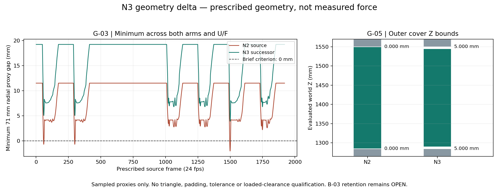

# F. N3 saved-model geometry audit

Source: [live_geometry_audit.json](live_geometry_audit.json), saved N3 SHA-256 `8038388e7d666e749af499bab65202c1a9fbed05647fc321e42c0aaffae161c6`. All integer product frames 1-1920 evaluated through Blender dependency graph. Units are source meters reported in millimeters; nominal body cylinder radius is 275 mm about world Z. G-03 subtracts a separate 71 mm radius from each evaluated 28-vertex cover-ring centroid. Vertex samples and centerline proxies do not prove triangle separation or loaded clearance. Subframe/continuous extrema are not bounded by this geometry sweep.

| Metric | Minimum mm | Frame |
|---|---|---|
| L_U_centerline_71mm | 6.809735 | 1500 |
| L_U_cover_vertex | 14.127852 | 1522 |
| L_F_centerline_71mm | 3.954128 | 1499 |
| L_F_cover_vertex | 12.813383 | 1063 |
| R_U_centerline_71mm | 7.589578 | 318 |
| R_U_cover_vertex | 14.132845 | 316 |
| R_F_centerline_71mm | 5.075889 | 300 |
| R_F_cover_vertex | 12.813389 | 1303 |

G-03 meets the brief's proxy criterion >= 0 mm. This is a limited CLOSED-A proposal, pending Ola review, with loaded clearance still OPEN. The old approximate +4 mm claim is historical, not the evidence source.

| Section | Minimum arc mm | Maximum arc mm |
|---|---|---|
| L_U | 382.558736 | 440.833735 |
| L_F | 253.993461 | 371.575841 |
| R_U | 382.558737 | 440.833731 |
| R_F | 253.993463 | 371.575844 |

Prescribed shoulder-to-wrist chord remains 524.531258 to 858.914857 mm. This is not loaded reach. Maximum U/F centerline junction discontinuity is 0.000068 mm.

## G-05 datums and B-03 residual

Measure lower-cover maximum evaluated Z to rotating-cover minimum Z, and rotating-cover maximum Z to upper-cover minimum Z. Both full-frame minima/maxima are 4.999995 mm. Nominal target: 5 mm at each edge, chosen for this visualization delta, not a manufacturing or injury-prevention allowance. Band world Z bounds change from approximately 1285-1550 mm to 1290-1545 mm; fixed covers remain unchanged. All 1,920 frame bounds were recomputed, not inferred from frame 1.

Positive axial separation clears the zero-gap model defect only. The unchanged inner volumes do not establish a guard or seal. B-03 remains High / OPEN for textile edge retention, protected overlap, fill containment, tolerance stack, padding displacement and pinch/abrasion fixture evidence. Owner for review/disposition: Ola; design responsibility allocation remains with Michael.

[geometry_lineage_verification.json](geometry_lineage_verification.json) identifies every changed mesh and verifies unchanged topology/schedules. [live_motion_audit.json](live_motion_audit.json) separately verifies wrist registration; all wrist/glove meshes remain untouched.

**Track A does not prove strike impulse.** Prescribed motion only; no measured pneumatic propulsion, contact force, pressure response, durability or real CV is claimed.

