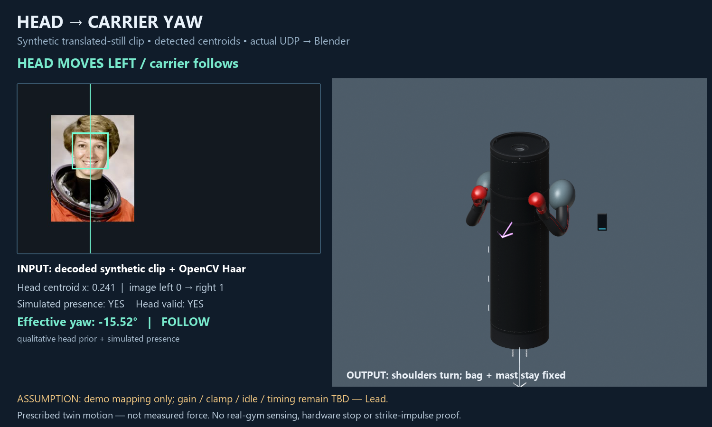
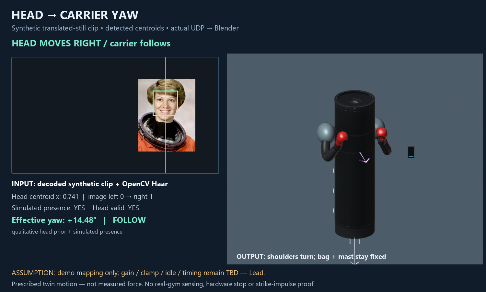
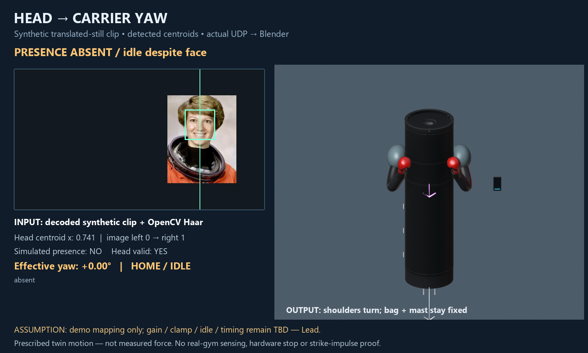
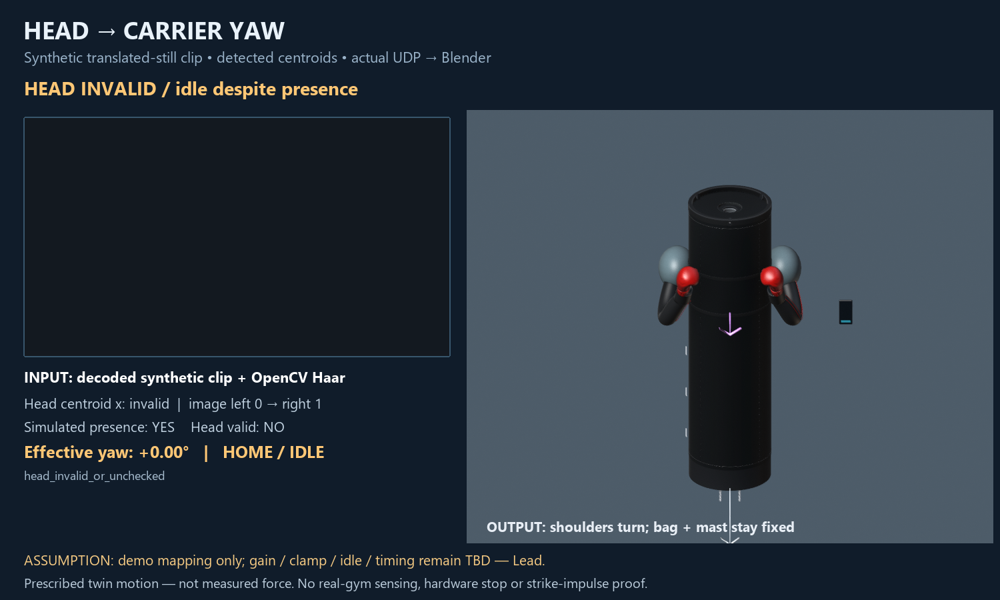
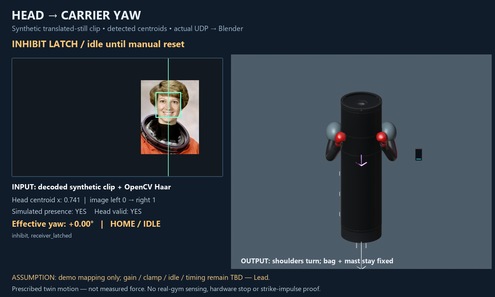
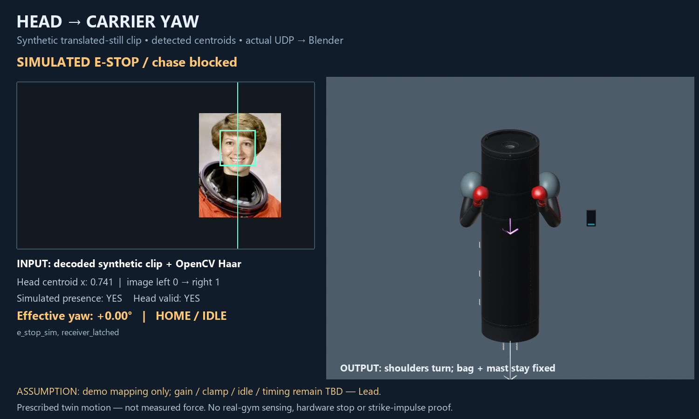

# C — Head/yaw evidence atlas

Inherited ACCEPTED-A stills. Every image: **prescribed motion — not measured force**. Input is a synthetic translated NASA still unless gym_spotcheck.json says GYM_DONE. Presence/fault flags are simulated.

## Head Left — frame 30

## Head Right — frame 68

## Absent — frame 78

## Invalid Head — frame 90

## Presence Fault — frame 102

## Stale Sync — frame 114

## Inhibit — frame 126

## E Stop — frame 138

## Gym qualitative branch

Status: **SKIPPED_NO_OPERATOR_APPROVAL**. Camera probe: **PRESENT**.

No invented L/R gym stills. If this branch is SKIPPED_NO_CAMERA or SKIPPED_NO_OPERATOR_APPROVAL, that is not a software FAIL.
